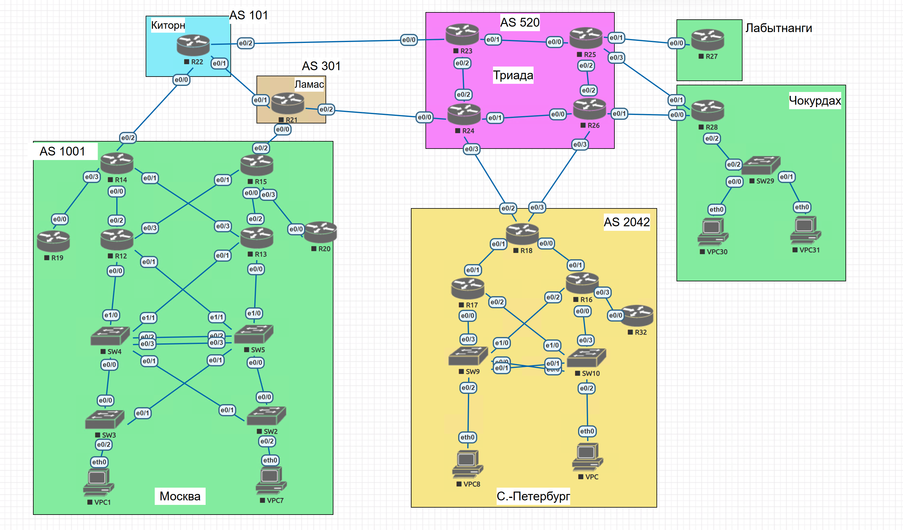

# Проектирование сети

## 1. Принципы

- Вся адресация из частного блока 10.0.0.0/8 (RFC 1918).
- Служебные сети (loopback и P2P) вынесены в 10.0.0.0/16, пользовательские и управляющие сети каждой площадки лежат в её собственном /16. Каждую площадку можно анонсировать одним суммарным префиксом.
- P2P-линки: /30. В блоке младший по номеру роутер получает меньший адрес.
- Пользовательские подсети: `.1` виртуальный адрес шлюза, `.2` основной роутер, `.3` резервный, `.10` хост.
- Управление: Loopback0 (/32) на роутерах, интерфейс VLAN 99 на коммутаторах.

## 2. Пулы

| Пул | Назначение |
|---|---|
| 10.0.0.0/24 | Loopback0 роутеров, `10.0.0.<номер роутера>/32` |
| 10.0.1.0/24 | P2P внутри AS 1001 (Москва) |
| 10.0.2.0/24 | P2P внутри AS 520 (Триада) |
| 10.0.3.0/24 | P2P внутри AS 2042 (Санкт-Петербург) |
| 10.0.100.0/24 | P2P между AS, а также к площадкам Лабытнанги и Чокурдах |
| 10.11.0.0/16 | Москва |
| 10.12.0.0/16 | Санкт-Петербург |
| 10.13.0.0/16 | Чокурдах |

В каждом из /16 площадки используются подсети 10.X.10.0/24 (VLAN 10), 10.X.20.0/24 (VLAN 20) и 10.X.99.0/24 (VLAN 99, управление).

## 3. Loopback

| Роутер | Loopback0 | Роутер | Loopback0 |
|---|---|---|---|
| R12 | 10.0.0.12/32 | R22 | 10.0.0.22/32 |
| R13 | 10.0.0.13/32 | R23 | 10.0.0.23/32 |
| R14 | 10.0.0.14/32 | R24 | 10.0.0.24/32 |
| R15 | 10.0.0.15/32 | R25 | 10.0.0.25/32 |
| R16 | 10.0.0.16/32 | R26 | 10.0.0.26/32 |
| R17 | 10.0.0.17/32 | R27 | 10.0.0.27/32 |
| R18 | 10.0.0.18/32 | R28 | 10.0.0.28/32 |
| R19 | 10.0.0.19/32 | R32 | 10.0.0.32/32 |
| R20 | 10.0.0.20/32 | | |
| R21 | 10.0.0.21/32 | | |

## 4. P2P-линки

| № | Подсеть | Устройство A: порт, IP | Устройство B: порт, IP |
|---|---|---|---|
| **AS 1001** | | | |
| 1 | 10.0.1.0/30 | R12 e0/2: .1 | R14 e0/0: .2 |
| 2 | 10.0.1.4/30 | R13 e0/3: .5 | R14 e0/1: .6 |
| 3 | 10.0.1.8/30 | R14 e0/3: .9 | R19 e0/0: .10 |
| 4 | 10.0.1.12/30 | R13 e0/2: .13 | R15 e0/0: .14 |
| 5 | 10.0.1.16/30 | R12 e0/3: .17 | R15 e0/1: .18 |
| 6 | 10.0.1.20/30 | R15 e0/3: .21 | R20 e0/0: .22 |
| **AS 520** | | | |
| 7 | 10.0.2.0/30 | R23 e0/1: .1 | R25 e0/0: .2 |
| 8 | 10.0.2.4/30 | R23 e0/2: .5 | R24 e0/2: .6 |
| 9 | 10.0.2.8/30 | R25 e0/2: .9 | R26 e0/2: .10 |
| 10 | 10.0.2.12/30 | R24 e0/1: .13 | R26 e0/0: .14 |
| **AS 2042** | | | |
| 11 | 10.0.3.0/30 | R16 e0/1: .1 | R18 e0/0: .2 |
| 12 | 10.0.3.4/30 | R17 e0/1: .5 | R18 e0/1: .6 |
| 13 | 10.0.3.8/30 | R16 e0/3: .9 | R32 e0/0: .10 |
| **Между AS и внешние площадки** | | | |
| 14 | 10.0.100.0/30 | R14 e0/2: .1 | R22 e0/0: .2 |
| 15 | 10.0.100.4/30 | R21 e0/1: .5 | R22 e0/1: .6 |
| 16 | 10.0.100.8/30 | R22 e0/2: .9 | R23 e0/0: .10 |
| 17 | 10.0.100.12/30 | R15 e0/2: .13 | R21 e0/0: .14 |
| 18 | 10.0.100.16/30 | R21 e0/2: .17 | R24 e0/0: .18 |
| 19 | 10.0.100.20/30 | R18 e0/2: .21 | R24 e0/3: .22 |
| 20 | 10.0.100.24/30 | R18 e0/3: .25 | R26 e0/3: .26 |
| 21 | 10.0.100.28/30 | R25 e0/1: .29 | R27 e0/0: .30 |
| 22 | 10.0.100.32/30 | R25 e0/3: .33 | R28 e0/1: .34 |
| 23 | 10.0.100.36/30 | R26 e0/1: .37 | R28 e0/0: .38 |

## 5. VLAN и пользовательские сети

| VLAN | Назначение |
|---|---|
| 10 | Первый VPC площадки |
| 20 | Второй VPC площадки |
| 99 | Управление коммутаторами |

VLAN существуют только в пределах площадки, поэтому номера на разных площадках совпадают, а подсети различаются вторым октетом.

### 5.1 Москва, 10.11.0.0/16

| VLAN | Подсеть | Виртуальный шлюз | R12 | R13 |
|---|---|---|---|---|
| 10 | 10.11.10.0/24 | 10.11.10.1 | 10.11.10.2 | 10.11.10.3 |
| 20 | 10.11.20.0/24 | 10.11.20.1 | 10.11.20.2 | 10.11.20.3 |
| 99 | 10.11.99.0/24 | 10.11.99.1 | 10.11.99.2 | 10.11.99.3 |

Интерфейсы роутеров:

| Роутер | Порт | Подключён к | Саб-интерфейс | IP |
|---|---|---|---|---|
| R12 | e0/0 | SW4 e1/0 | e0/0.10 | 10.11.10.2/24 |
| R12 | e0/0 | SW4 e1/0 | e0/0.99 | 10.11.99.2/24 |
| R12 | e0/1 | SW5 e1/1 | e0/1.20 | 10.11.20.2/24 |
| R13 | e0/0 | SW5 e1/0 | e0/0.10 | 10.11.10.3/24 |
| R13 | e0/0 | SW5 e1/0 | e0/0.99 | 10.11.99.3/24 |
| R13 | e0/1 | SW4 e1/1 | e0/1.20 | 10.11.20.3/24 |

### 5.2 Санкт-Петербург, 10.12.0.0/16

| VLAN | Подсеть | Виртуальный шлюз | R17 | R16 |
|---|---|---|---|---|
| 10 | 10.12.10.0/24 | 10.12.10.1 | 10.12.10.2 | 10.12.10.3 |
| 20 | 10.12.20.0/24 | 10.12.20.1 | 10.12.20.2 | 10.12.20.3 |
| 99 | 10.12.99.0/24 | 10.12.99.1 | 10.12.99.2 | 10.12.99.3 |

Интерфейсы роутеров:

| Роутер | Порт | Подключён к | Саб-интерфейс | IP |
|---|---|---|---|---|
| R17 | e0/0 | SW9 e0/3 | e0/0.10 | 10.12.10.2/24 |
| R17 | e0/0 | SW9 e0/3 | e0/0.99 | 10.12.99.2/24 |
| R17 | e0/2 | SW10 e1/0 | e0/2.20 | 10.12.20.2/24 |
| R16 | e0/0 | SW10 e0/3 | e0/0.10 | 10.12.10.3/24 |
| R16 | e0/0 | SW10 e0/3 | e0/0.99 | 10.12.99.3/24 |
| R16 | e0/2 | SW9 e1/0 | e0/2.20 | 10.12.20.3/24 |

### 5.3 Чокурдах, 10.13.0.0/16

Шлюзом служит R28 (один роутер, один линк до коммутатора).

| VLAN | Подсеть | Шлюз | Интерфейс R28 |
|---|---|---|---|
| 10 | 10.13.10.0/24 | 10.13.10.1 | e0/2.10 |
| 20 | 10.13.20.0/24 | 10.13.20.1 | e0/2.20 |
| 99 | 10.13.99.0/24 | 10.13.99.1 | e0/2.99 |

Лабытнанги (R27): хостов нет, у площадки loopback и один P2P-линк (№ 21).

## 6. Управление коммутаторами (интерфейс VLAN 99)

| Коммутатор | Площадка | IP | Шлюз по умолчанию |
|---|---|---|---|
| SW2 | Москва | 10.11.99.102/24 | 10.11.99.1 |
| SW3 | Москва | 10.11.99.103/24 | 10.11.99.1 |
| SW4 | Москва | 10.11.99.104/24 | 10.11.99.1 |
| SW5 | Москва | 10.11.99.105/24 | 10.11.99.1 |
| SW9 | Санкт-Петербург | 10.12.99.109/24 | 10.12.99.1 |
| SW10 | Санкт-Петербург | 10.12.99.110/24 | 10.12.99.1 |
| SW29 | Чокурдах | 10.13.99.129/24 | 10.13.99.1 |

## 7. Хосты

| Хост | Площадка | Подключён к | VLAN | IP | Шлюз |
|---|---|---|---|---|---|
| VPC1 | Москва | SW3 e0/2 | 10 | 10.11.10.10/24 | 10.11.10.1 |
| VPC7 | Москва | SW2 e0/2 | 20 | 10.11.20.10/24 | 10.11.20.1 |
| VPC8 | Санкт-Петербург | SW9 e0/2 | 10 | 10.12.10.10/24 | 10.12.10.1 |
| VPC (SPb) | Санкт-Петербург | SW10 e0/2 | 20 | 10.12.20.10/24 | 10.12.20.1 |
| VPC30 | Чокурдах | SW29 e0/0 | 10 | 10.13.10.10/24 | 10.13.10.1 |
| VPC31 | Чокурдах | SW29 e0/1 | 20 | 10.13.20.10/24 | 10.13.20.1 |

## 8. Коммутация: VLAN, порты, защита от петель

Используется только IPv4.

### 8.1 Транки и VLAN

- На всех транках native VLAN 999. Он пустой: на нём нет хостов и интерфейсов, поэтому нетегированный трафик не попадает в рабочие VLAN.
- На всех транках явно перечислены разрешённые VLAN. К роутерам идут только те VLAN, которые нужны на этой ноге, между коммутаторами все три (10, 20, 99), потому что это запасные пути.
- VTP отключён (`transparent`): VLAN всего три, синхронизация не нужна, а рассылка VTP с чужой базой может стереть VLAN на всех коммутаторах.
- Все четыре VLAN (10, 20, 99, 999) созданы на каждом коммутаторе площадки, иначе резервный путь для VLAN, которого нет на транзитном коммутаторе, не будет работать.

### 8.2 Spanning tree и распределение нагрузки

Режим Rapid-PVST+: быстрая сходимость и отдельное дерево на каждый VLAN. Корни разнесены по VLAN, поэтому оба межкоммутаторных пути используются, а не один простаивает в блокировке.

| Площадка | VLAN | Корень (priority 4096) | Запасной корень (priority 8192) |
|---|---|---|---|
| Москва | 10, 99 | SW4 | SW5 |
| Москва | 20 | SW5 | SW4 |
| Санкт-Петербург | 10, 99 | SW9 | SW10 |
| Санкт-Петербург | 20 | SW10 | SW9 |

Приоритеты заданы явно, а не командой `root primary`: результат не зависит от того, какие коммутаторы появятся в сети позже. Остальные коммутаторы (SW2, SW3, SW29) остаются с приоритетом по умолчанию и корнем стать не могут.

Основной шлюз каждого VLAN подключён к корневому коммутатору этого VLAN, поэтому трафик к шлюзу не делает лишний проход через межкоммутаторный линк.

### 8.3 Агрегация линков

Два параллельных линка между парными коммутаторами объединены в port-channel по LACP (режим `active` на обоих концах). Для STP это один линк: вместо одного заблокированного порта получаем удвоенную полосу и сохранение связи при отказе одного из линков.

| Пара | Port-channel | Порты |
|---|---|---|
| SW4 и SW5 | Po1 | e0/2 и e0/3 на обоих коммутаторах |
| SW9 и SW10 | Po1 | e0/0 и e0/1 на обоих коммутаторах |

### 8.4 Защита портов

- На access-портах к VPC включены `portfast` (порт сразу в состоянии forwarding) и `bpduguard` (при подключении коммутатора порт уходит в err-disabled, петля не создаётся).

### 8.5 Резервирование шлюзов

В Москве и Санкт-Петербурге шлюзы работают парой по HSRP версии 2. Номер группы равен номеру VLAN, виртуальный адрес `.1`. Основной роутер (R12 и R17) имеет приоритет 110 и `preempt`, резервный (R13 и R16) приоритет по умолчанию 100. VLAN разнесены по портам роутеров так, чтобы каждый VLAN терминировался на обоих роутерах пары, а на каждом коммутаторе пары был подключён хотя бы один шлюз каждого VLAN. Отказ любого одного коммутатора или роутера не оставляет VLAN без шлюза. В Чокурдахе один роутер и один линк, резервировать нечего.

### 8.6 Порты коммутаторов

| Коммутатор | Порт | Режим | Подключён к | VLAN |
|---|---|---|---|---|
| SW4 | e1/0 | trunk | R12 e0/0 | 10, 99 |
| SW4 | e1/1 | trunk | R13 e0/1 | 20 |
| SW4 | e0/0 | trunk | SW3 e0/0 | 10, 20, 99 |
| SW4 | e0/1 | trunk | SW2 e0/1 | 10, 20, 99 |
| SW4 | e0/2, e0/3 | Po1 (LACP), trunk | SW5 e0/2, e0/3 | 10, 20, 99 |
| SW5 | e1/0 | trunk | R13 e0/0 | 10, 99 |
| SW5 | e1/1 | trunk | R12 e0/1 | 20 |
| SW5 | e0/0 | trunk | SW2 e0/0 | 10, 20, 99 |
| SW5 | e0/1 | trunk | SW3 e0/1 | 10, 20, 99 |
| SW5 | e0/2, e0/3 | Po1 (LACP), trunk | SW4 e0/2, e0/3 | 10, 20, 99 |
| SW3 | e0/0 | trunk | SW4 e0/0 | 10, 20, 99 |
| SW3 | e0/1 | trunk | SW5 e0/1 | 10, 20, 99 |
| SW3 | e0/2 | access | VPC1 eth0 | 10 |
| SW2 | e0/0 | trunk | SW5 e0/0 | 10, 20, 99 |
| SW2 | e0/1 | trunk | SW4 e0/1 | 10, 20, 99 |
| SW2 | e0/2 | access | VPC7 eth0 | 20 |
| SW9 | e0/3 | trunk | R17 e0/0 | 10, 99 |
| SW9 | e1/0 | trunk | R16 e0/2 | 20 |
| SW9 | e0/0, e0/1 | Po1 (LACP), trunk | SW10 e0/0, e0/1 | 10, 20, 99 |
| SW9 | e0/2 | access | VPC8 eth0 | 10 |
| SW10 | e0/3 | trunk | R16 e0/0 | 10, 99 |
| SW10 | e1/0 | trunk | R17 e0/2 | 20 |
| SW10 | e0/0, e0/1 | Po1 (LACP), trunk | SW9 e0/0, e0/1 | 10, 20, 99 |
| SW10 | e0/2 | access | VPC (SPb) eth0 | 20 |
| SW29 | e0/2 | trunk | R28 e0/2 | 10, 20, 99 |
| SW29 | e0/0 | access | VPC30 eth0 | 10 |
| SW29 | e0/1 | access | VPC31 eth0 | 20 |

## 9. Соответствие требованиям задания

| Требование | Где описано |
|---|---|
| 1. Адресное пространство | Разделы 1 и 2 |
| 2. IP-адреса на каждом активном порту | Разделы 3, 4 и 5 |
| 3. Каждый VPC в своём VLAN | Разделы 5, 7 и 8.6 |
| 4. VLAN и Loopback управления | Разделы 3 и 6 |
| 5. Нет broadcast-штормов, линки используются оптимально | Раздел 8 |
| 6. IPv4 | Вся адресация |
