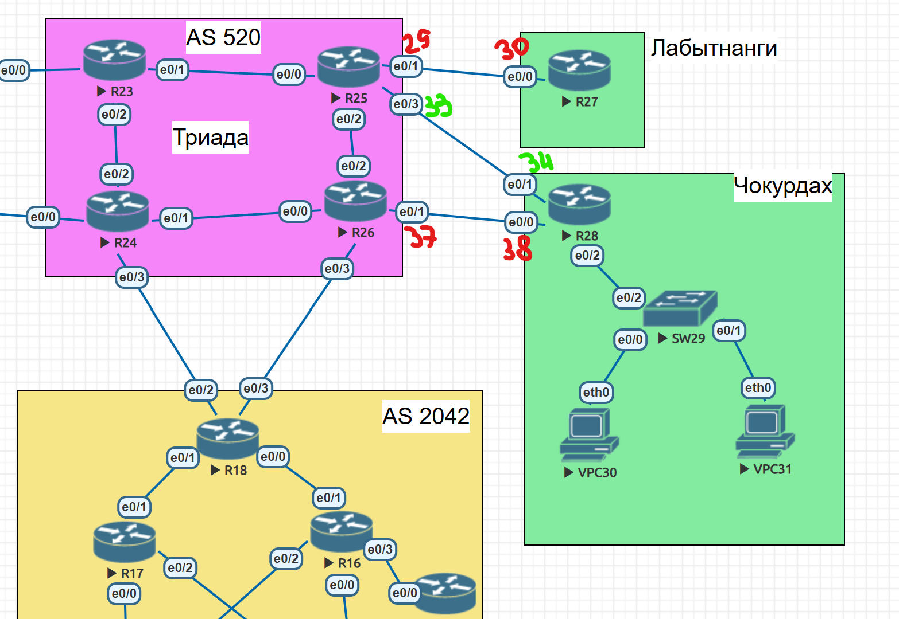

# PBR: политика маршрутизации



Фрагмент топологии из [работы 1](../1.%20Проектирование%20сети/README.md): офис Чокурдах (R28, SW29, VPC30 и VPC31), провайдерская сеть AS 520 (R25, R26) и офис Лабытнанги (R27). На линках подписаны последние октеты адресов из подсети 10.0.100.0/24: 29 и 30 (R25 и R27), 33 и 34 (R25 и R28), 37 и 38 (R26 и R28).

## 1. Задача и допущения

Нужно было настроить политику маршрутизации для сетей офиса Чокурдах, распределить трафик между двумя линками до провайдера, отслеживать линки через IP SLA (только IPv4) и задать маршрут по умолчанию для офиса Лабытнанги.

Я принял два допущения:

- Провайдером для Чокурдаха считаю AS 520: R28 подключён к R25 и R26.
- В сети только IPv4 (в конфигах `no ipv6 cef`, IPv6-адресации в [работе 1](../1.%20Проектирование%20сети/README.md) нет), поэтому PBR для IPv6 я не настраивал.

| Линк | Порт R28, IP | Порт провайдера, IP | Подсеть |
|---|---|---|---|
| A | e0/1, 10.0.100.34 | R25 e0/3, 10.0.100.33 | 10.0.100.32/30 |
| B | e0/0, 10.0.100.38 | R26 e0/1, 10.0.100.37 | 10.0.100.36/30 |
| Лабытнанги | R27 e0/0, 10.0.100.30 | R25 e0/1, 10.0.100.29 | 10.0.100.28/30 |

Сети офиса за R28 (e0/2.X): VLAN 10: 10.13.10.0/24 (VPC30), VLAN 20: 10.13.20.0/24 (VPC31), VLAN 99: 10.13.99.0/24 (управление SW29).

## 2. С чего я начал

Перед любыми изменениями я снял конфигурации R25, R26, R27 и R28 и сверил адреса и порты со своей [работой 1](../1.%20Проектирование%20сети/README.md). Всё совпало: линки A и B, линк до Лабытнанги.

Главное, что я увидел: **ни на одном из четырёх роутеров нет протоколов маршрутизации и статических маршрутов**, только connected-сети. Из этого следовало три вывода:

1. R28 не знает пути за свои линки.
2. R25 и R26 не знают сеть 10.13.0.0/16, поэтому ответ на пакет из Чокурдаха вернуться не сможет. Без обратного пути PBR проверить нельзя.
3. R27 не имеет выхода никуда, кроме непосредственного соседа.

Поэтому я разделил работу на часть А (R28 и R27, это само задание) и часть Б (эмуляция провайдера на R25 и R26, нужна только для проверки).

## 3. План и порядок

Порядок я выбрал так, чтобы каждый этап можно было проверить до следующего и чтобы на каждый объект ссылалось то, что уже создано:

1. Эмуляция провайдера (обратные маршруты и тестовая цель).
2. R28: IP SLA и объекты `track`. Проверка: оба трека Up.
3. R28: маршруты по умолчанию, привязанные к трекам.
4. R28: ACL, route-map, привязка политики к интерфейсам. Проверка: VLAN 20 уходит на линк B.
5. R27: маршрут по умолчанию. Проверка: ping до тестовой цели.
6. Проверка отказа линка A: отключаю порт на стороне провайдера, смотрю путь VLAN 10, возвращаю порт.

Распределение, которое я выбрал:

| Трафик | Основной линк | Резервный линк |
|---|---|---|
| VLAN 10 | A (R25, 10.0.100.33) | B |
| VLAN 20 | B (R26, 10.0.100.37) | A |
| VLAN 99 и сам R28 | вне PBR, маршрут по умолчанию: A, затем B | |
| Внутри 10.13.0.0/16 | вне PBR | |

## 4. Ход работы

### 4.1 Эмуляция провайдера

Сети за провайдером у меня нет, поэтому я создал «Интернет» из одного адреса из блока TEST-NET-3 ([RFC 5737](https://www.rfc-editor.org/rfc/rfc5737)): 203.0.113.1/32. Он зарезервирован для документации и в боевой адресации не встречается. Цель я повесил на R25, а R26 доходит до неё через соседа. Благодаря этому трассировка показывает, через какого провайдерского роутера прошёл трафик.

```text
! R25
interface Loopback100
 description TEST: Internet emulate (RFC 5737)
 ip address 203.0.113.1 255.255.255.255
ip route 10.13.0.0 255.255.0.0 10.0.100.34
ip route 10.13.0.0 255.255.0.0 10.0.2.10 200

! R26
ip route 203.0.113.1 255.255.255.255 10.0.2.9
ip route 10.13.0.0 255.255.0.0 10.0.100.38
```

Плавающий маршрут на R25 (AD 200) через R26 нужен для сценария «линк A отключён»: иначе R25 не сможет вернуть ответ на VLAN 10, пришедший через R26.

### 4.2 IP SLA и track на R28

Для каждого линка я сделал по ICMP-пробе до next-hop со своего адреса и по треку на её достижимость:

```text
ip sla 1
 icmp-echo 10.0.100.33 source-ip 10.0.100.34
 frequency 5
ip sla schedule 1 life forever start-time now
!
ip sla 2
 icmp-echo 10.0.100.37 source-ip 10.0.100.38
 frequency 5
ip sla schedule 2 life forever start-time now
!
track 1 ip sla 1 reachability
 delay down 10 up 20
track 2 ip sla 2 reachability
 delay down 10 up 20
```

Пробу я ставлю именно до next-hop: он лежит в connected /30, поэтому проба всегда уходит в нужный порт и отдельные статические /32 для неё не нужны. Таймаут пробы и порог оставлены по умолчанию (5000 мс). `delay down 10 up 20` нужен, чтобы один потерянный пакет не переключал весь офис: трек уходит в Down после 10 с недоступности и возвращается в Up после 20 с стабильной работы. Расчётное время переключения на резервный линк около 20 с: до 5 с до очередной пробы, 5 с таймаут и 10 с `delay down`.

Состояние треков и проб:

```text
R28#show track
Track 1
  IP SLA 1 reachability
  Reachability is Up
    4 changes, last change 00:10:08
  Delay up 20 secs, down 10 secs
  Latest operation return code: OK
  Latest RTT (millisecs) 1
  Tracked by:
    Route Map 0
    Static IP Routing 0
Track 2
  IP SLA 2 reachability
  Reachability is Up
    2 changes, last change 00:17:58
  Delay up 20 secs, down 10 secs
  Latest operation return code: OK
  Latest RTT (millisecs) 1
  Tracked by:
    Route Map 0
    Static IP Routing 0

R28#show ip sla statistics
IPSLAs Latest Operation Statistics

IPSLA operation id: 1
        Latest RTT: 1 milliseconds
Latest operation start time: 16:08:19 UTC Fri Oct 9 2026
Latest operation return code: OK
Number of successes: 209
Number of failures: 0
Operation time to live: Forever

IPSLA operation id: 2
        Latest RTT: 1 milliseconds
Latest operation start time: 16:08:19 UTC Fri Oct 9 2026
Latest operation return code: OK
Number of successes: 229
Number of failures: 0
Operation time to live: Forever
```

Оба трека в состоянии Up, обе пробы возвращают `OK` без единой ошибки. В строке `Tracked by` видно, что треки используются и в route-map, и в статических маршрутах.

### 4.3 Маршруты по умолчанию на R28

```text
ip route 0.0.0.0 0.0.0.0 10.0.100.33 track 1
ip route 0.0.0.0 0.0.0.0 10.0.100.37 10 track 2
```

Второй маршрут «плавающий» (AD 10 вместо 1): пока жив линк A, он в таблице не появляется, и порядок для VLAN 99 и самого R28 однозначный. Равные AD дали бы балансировку по потокам, а для управляющей сети это лишняя неопределённость.

### 4.4 ACL, route-map и привязка политики

```text
ip access-list extended PBR-VLAN10
 deny   ip 10.13.10.0 0.0.0.255 10.13.0.0 0.0.255.255
 permit ip 10.13.10.0 0.0.0.255 any
ip access-list extended PBR-VLAN20
 deny   ip 10.13.20.0 0.0.0.255 10.13.0.0 0.0.255.255
 permit ip 10.13.20.0 0.0.0.255 any
!
route-map PBR-CHOKURDAH permit 10
 match ip address PBR-VLAN10
 set ip next-hop verify-availability 10.0.100.33 10 track 1
 set ip next-hop verify-availability 10.0.100.37 20 track 2
route-map PBR-CHOKURDAH permit 20
 match ip address PBR-VLAN20
 set ip next-hop verify-availability 10.0.100.37 10 track 2
 set ip next-hop verify-availability 10.0.100.33 20 track 1
!
interface Ethernet0/2.10
 ip policy route-map PBR-CHOKURDAH
interface Ethernet0/2.20
 ip policy route-map PBR-CHOKURDAH
```

Почему так:

- Политику я вешаю на **входящие** саб-интерфейсы: решение принимается там, где пакет входит в роутер.
- Первой строкой каждого ACL стоит `deny` на 10.13.0.0/16. Без неё PBR перехватил бы трафик VLAN 10 → VLAN 20 и отправил его провайдеру вместо внутренней маршрутизации.
- Для каждой сети в route-map по два next-hop с разными sequence: основной с 10, резервный с 20. Если трек основного Down, берётся следующий.
- Интерфейс e0/2.99 я в политику не включал: управление SW29 не должно зависеть от PBR.
- Если оба трека Down, по документации Cisco пакеты идут по таблице маршрутизации ([PBR Support for Multiple Tracking Options](https://www.cisco.com/en/US/docs/ios/iproute_pi/configuration/guide/iri_prb_mult_track_external_docbase_0900e4b1810fe379_4container_external_docbase_0900e4b181525fed.html)), поэтому маршруты из 4.3 привязаны к тем же трекам.

Состояние политики:

```text
R28#show route-map PBR-CHOKURDAH
route-map PBR-CHOKURDAH, permit, sequence 10
  Match clauses:
    ip address (access-lists): PBR-VLAN10
  Set clauses:
    ip next-hop verify-availability 10.0.100.33 10 track 1  [up]
    ip next-hop verify-availability 10.0.100.37 20 track 2  [up]
  Policy routing matches: 109 packets, 11790 bytes
route-map PBR-CHOKURDAH, permit, sequence 20
  Match clauses:
    ip address (access-lists): PBR-VLAN20
  Set clauses:
    ip next-hop verify-availability 10.0.100.37 10 track 2  [up]
    ip next-hop verify-availability 10.0.100.33 20 track 1  [up]
  Policy routing matches: 14 packets, 1488 bytes

R28#show ip policy
Interface      Route map
Ethernet0/2.10 PBR-CHOKURDAH
Ethernet0/2.20 PBR-CHOKURDAH
```

Все четыре next-hop в состоянии `[up]`, политика привязана к обоим саб-интерфейсам (e0/2.99 в списке нет, как и задумано). Счётчики `Policy routing matches` растут по обеим веткам: политика реально обрабатывает трафик VLAN 10 (109 пакетов) и VLAN 20 (14 пакетов).

### 4.5 Лабытнанги (R27)

```text
ip route 0.0.0.0 0.0.0.0 10.0.100.29
```

Линк у R27 один, переключаться некуда, поэтому трекинга нет.

```text
R27#ping 203.0.113.1
Type escape sequence to abort.
Sending 5, 100-byte ICMP Echos to 203.0.113.1, timeout is 2 seconds:
.!!!!
Success rate is 80 percent (4/5), round-trip min/avg/max = 1/1/1 ms
```

Первый пакет потерян, остальные четыре дошли. Это ожидаемо для первого пинга после настройки: пока R27 определяет MAC-адрес R25 по ARP, первый эхо-запрос отбрасывается.

## 5. Тестирование

| № | Проверка | Результат |
|---|---|---|
| 1 | Состояние IP SLA и треков на R28 (раздел 4.2) | Оба трека Up, обе пробы `OK`, ошибок 0 |
| 2 | Состояние route-map и привязка политики (раздел 4.4) | Все next-hop `[up]`, политика на e0/2.10 и e0/2.20, счётчики растут |
| 3 | VPC30 (VLAN 10) → 203.0.113.1 | Через линк A, на втором хопе 10.0.100.33 |
| 4 | VPC31 (VLAN 20) → 203.0.113.1 | Через линк B, на втором хопе 10.0.100.37, на третьем 10.0.2.9 |
| 5 | R27 (Лабытнанги) → 203.0.113.1 (раздел 4.5) | 4 из 5, первый пакет потерян из-за ARP |
| 6 | Отказ линка A: `shutdown` на R25 e0/3, затем `no shutdown` (раздел 5.3) | VLAN 10 перешёл на линк B (на втором хопе 10.0.100.37), после возврата линка снова идёт через A (10.0.100.33) |

Хосты проверял командами VPCS `ping 203.0.113.1` и `trace 203.0.113.1`.

### 5.1 VPC30, VLAN 10

```text
VPCS> ping 203.0.113.1
84 bytes from 203.0.113.1 icmp_seq=1 ttl=254 time=0.503 ms
84 bytes from 203.0.113.1 icmp_seq=2 ttl=254 time=0.669 ms
84 bytes from 203.0.113.1 icmp_seq=3 ttl=254 time=0.798 ms
84 bytes from 203.0.113.1 icmp_seq=4 ttl=254 time=0.621 ms
84 bytes from 203.0.113.1 icmp_seq=5 ttl=254 time=0.707 ms

VPCS> trace 203.0.113.1
trace to 203.0.113.1, 8 hops max, press Ctrl+C to stop
 1   10.13.10.1   0.543 ms  0.326 ms  0.222 ms
 2   *10.0.100.33   0.538 ms (ICMP type:3, code:3, Destination port unreachable)  *
```

### 5.2 VPC31, VLAN 20

```text
VPCS> trace 203.0.113.1
trace to 203.0.113.1, 8 hops max, press Ctrl+C to stop
 1   10.13.20.1   0.317 ms  0.263 ms  0.291 ms
 2   10.0.100.37   0.434 ms  0.375 ms  0.383 ms
 3   *10.0.2.9   0.529 ms (ICMP type:3, code:3, Destination port unreachable)  *

VPCS> ping 203.0.113.1
84 bytes from 203.0.113.1 icmp_seq=1 ttl=254 time=0.878 ms
84 bytes from 203.0.113.1 icmp_seq=2 ttl=254 time=1.369 ms
84 bytes from 203.0.113.1 icmp_seq=3 ttl=254 time=0.865 ms
84 bytes from 203.0.113.1 icmp_seq=4 ttl=254 time=0.706 ms
84 bytes from 203.0.113.1 icmp_seq=5 ttl=254 time=0.741 ms
```

Вывод: VLAN 10 идёт через линк A, VLAN 20 через линк B, оба ping проходят (5 из 5). Маршрут по умолчанию ведёт через R25 (AD 1), поэтому направить VLAN 20 на 10.0.100.37 могла только политика.

### 5.3 Отказ линка A

Чтобы проверить отслеживание, я отключил порт R25 e0/3 (линк A со стороны провайдера), посмотрел, куда пойдёт трафик VLAN 10 с VPC30, и вернул порт.

```text
R25(config)#interface ethernet 0/3
R25(config-if)#shutdown
*Oct  9 15:55:32.548: %LINK-5-CHANGED: Interface Ethernet0/3, changed state to administratively down
*Oct  9 15:55:33.552: %LINEPROTO-5-UPDOWN: Line protocol on Interface Ethernet0/3, changed state to down

R25(config-if)#no shutdown
*Oct  9 15:57:08.425: %LINK-3-UPDOWN: Interface Ethernet0/3, changed state to up
*Oct  9 15:57:09.429: %LINEPROTO-5-UPDOWN: Line protocol on Interface Ethernet0/3, changed state to up
```

**До отказа.** VLAN 10 идёт через линк A, ответы приходят с `ttl=254`:

```text
VPCS> trace 203.0.113.1
trace to 203.0.113.1, 8 hops max, press Ctrl+C to stop
 1   10.13.10.1   0.342 ms  0.333 ms  0.336 ms
 2   *10.0.100.33   0.601 ms (ICMP type:3, code:3, Destination port unreachable)  *

VPCS> ping 203.0.113.1
84 bytes from 203.0.113.1 icmp_seq=1 ttl=254 time=0.673 ms
84 bytes from 203.0.113.1 icmp_seq=2 ttl=254 time=0.680 ms
84 bytes from 203.0.113.1 icmp_seq=3 ttl=254 time=0.600 ms
84 bytes from 203.0.113.1 icmp_seq=4 ttl=254 time=0.672 ms
84 bytes from 203.0.113.1 icmp_seq=5 ttl=254 time=0.973 ms
```

**Во время отказа.** Связь не пропала: пинг проходит, но `ttl` ответов стал 253, а трассировка пошла через R26. Все повторные трассировки, которые я делал, пока линк был отключён, показали один и тот же путь:

```text
VPCS> ping 203.0.113.1
84 bytes from 203.0.113.1 icmp_seq=1 ttl=253 time=0.679 ms
84 bytes from 203.0.113.1 icmp_seq=2 ttl=253 time=1.644 ms

VPCS> trace 203.0.113.1
trace to 203.0.113.1, 8 hops max, press Ctrl+C to stop
 1   10.13.10.1   0.568 ms  0.421 ms  0.319 ms
 2   10.0.100.37   0.556 ms  0.493 ms  0.535 ms
 3   *10.0.2.9   0.823 ms (ICMP type:3, code:3, Destination port unreachable)  *
```

**После возврата линка.** Трассировка снова идёт через R25:

```text
VPCS> trace 203.0.113.1
trace to 203.0.113.1, 8 hops max, press Ctrl+C to stop
 1   10.13.10.1   0.445 ms  0.229 ms  0.257 ms
 2   *10.0.100.33   0.430 ms (ICMP type:3, code:3, Destination port unreachable)  *
```

Как я это читаю:

- Путь VLAN 10 сменился с 10.0.100.33 на 10.0.100.37 без моего вмешательства в конфигурацию R28. Раз политика отправила трафик на второй next-hop, значит, трек 1 перешёл в Down и `verify-availability` пропустил первый next-hop.
- `ttl` ответов уменьшился на единицу (254 → 253) не случайно. Пока e0/3 на R25 выключен, R25 возвращает ответ не напрямую в R28, а через R26 по плавающему маршруту (AD 200, раздел 4.1): в обратном пути на один роутер больше. Это подтверждает, что резервный путь работает в обе стороны.
- После `no shutdown` линк поднялся в 15:57:08, а VLAN 10 вернулся на A уже после `delay up 20`: трек не возвращает трафик на линк сразу, а ждёт 20 с стабильной работы.
- Точное время переключения я не измерял: в логах R25 есть только моменты `shutdown` (15:55:32) и `no shutdown` (15:57:08).

## 6. Что оказалось неочевидным

**Как читать trace.** Сначала мне показалось, что трейсы рвутся, потому что последним хопом не появляется 203.0.113.1. На самом деле это финиш: пакет дошёл до цели, а цель ответила «port unreachable» (ICMP type 3, code 3), и VPCS на этом заканчивает. Звёздочки в последнем хопе, вероятно, объясняются ограничением скорости ICMP unreachable на IOS (по умолчанию не чаще раза в 500 мс). Поломка выглядела бы иначе: `* * *` в каждом хопе и trace, ползущий до 8-го хопа без ответов.

**Чьим адресом подписан ответ.** Роутер подписывает ответ адресом интерфейса, через который пакет вошёл. Поэтому у VPC30 финальный хоп 10.0.100.33 (вход в R25 через e0/3), а у VPC31 10.0.2.9 (вход в R25 через e0/2 со стороны R26). Это два интерфейса одного роутера R25. Именно по этим адресам видно путь: хоп 2 равен 10.0.100.33 (через R25) или 10.0.100.37 (через R26).

**Откуда хоп 3 у VPC31.** PBR отправляет VLAN 20 только на R26 (хоп 2). Дальше пакет пересылает уже сам провайдер: цель 203.0.113.1 стоит на R25, а на R26 к ней статический маршрут через 10.0.2.9. Это особенность моей эмуляции из 4.1, а не PBR.

## 7. Ограничения

- **Проба до next-hop не видит обрыв за R25 и R26.** Если провайдерский роутер жив, а авария у него дальше, трек останется Up. В боевой сети цель пробы выносят за провайдера и закрепляют к ней статический /32 через конкретный линк. Для лабораторной работы я оставил проверку next-hop.
- Порядок выбора next-hop по sequence в `verify-availability` в документации прямо не описан: в примере Cisco меньший sequence берётся первым.
- Время переключения (около 20 с) расчётное, исходя из параметров пробы и `delay`.
- Синтаксис `delay` у `track` я взял из примера на [networklessons](https://networklessons.com/ip-routing/reliable-static-routing-with-ip-sla).
- NAT не настраивался: вся сеть в 10.0.0.0/8, AS 520 считается маршрутизирующей эту адресацию без трансляции.
- Балансировка по потокам не делалась: PBR распределяет по сетям, а не по сессиям.

## 8. Откат

Первым делом снимаю политику с интерфейсов, трафик сразу идёт по маршрутам по умолчанию:

```text
interface Ethernet0/2.10
 no ip policy route-map
interface Ethernet0/2.20
 no ip policy route-map
```

Полный откат R28 в обратном порядке:

```text
no route-map PBR-CHOKURDAH
no ip access-list extended PBR-VLAN10
no ip access-list extended PBR-VLAN20
no ip route 0.0.0.0 0.0.0.0 10.0.100.33 track 1
no ip route 0.0.0.0 0.0.0.0 10.0.100.37 10 track 2
no track 1
no track 2
no ip sla schedule 1
no ip sla schedule 2
no ip sla 1
no ip sla 2
```

Откат R27:

```text
no ip route 0.0.0.0 0.0.0.0 10.0.100.29
```

Эмуляцию провайдера убираю после проверок: одинаковые маршруты на R25 и R26 помешали бы, когда в AS 520 появится настоящая маршрутизация.

```text
! R25
no ip route 10.13.0.0 255.255.0.0 10.0.100.34
no ip route 10.13.0.0 255.255.0.0 10.0.2.10 200
no interface Loopback100

! R26
no ip route 203.0.113.1 255.255.255.255 10.0.2.9
no ip route 10.13.0.0 255.255.0.0 10.0.100.38
```

## 9. Соответствие требованиям

| Требование | Где |
|---|---|
| 1. Политика маршрутизации для сетей офиса | Разделы 3 и 4.4 |
| 2. Распределение трафика между двумя линками | Разделы 3, 4.4 и 5 |
| 3. Отслеживание линка через IP SLA (IPv4) | Разделы 4.2, 5 и 5.3 |
| 4. Маршрут по умолчанию для Лабытнанги | Раздел 4.5 |
| 5. План работы и изменения в документации | Весь документ |

## Источники

- Cisco, [Policy Based Routing with Object Tracking](https://bxin.cisco.com/c/en/us/support/docs/ip/ip-routed-protocols/48003-pbrtracking.html): `set ip next-hop verify-availability`, привязка `ip policy route-map`.
- Cisco, [PBR Support for Multiple Tracking Options](https://www.cisco.com/en/US/docs/ios/iproute_pi/configuration/guide/iri_prb_mult_track_external_docbase_0900e4b1810fe379_4container_external_docbase_0900e4b181525fed.html): поведение при недоступности всех next-hop.
- Cisco, [Configuring IP SLAs ICMP Echo Operations](https://www.cisco.com/c/en/us/td/docs/ios-xml/ios/ipsla/configuration/15-mt/sla-15-mt-book/sla_icmp_echo.html): `ip sla`, `icmp-echo`, `frequency`, `ip sla schedule`.
- NetworkLessons, [Reliable Static Routing with IP SLA](https://networklessons.com/ip-routing/reliable-static-routing-with-ip-sla): `track ... ip sla ... reachability`, `delay`, статический маршрут с `track`.
- IETF, [RFC 5737](https://www.rfc-editor.org/rfc/rfc5737): блок 203.0.113.0/24 для документации.
